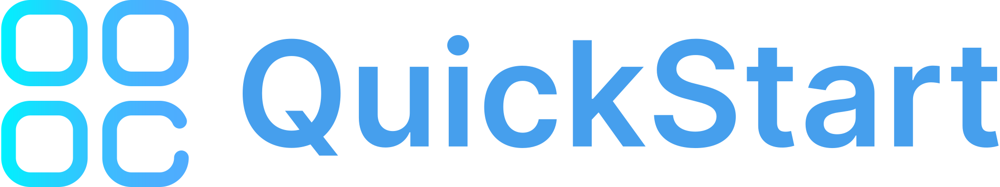
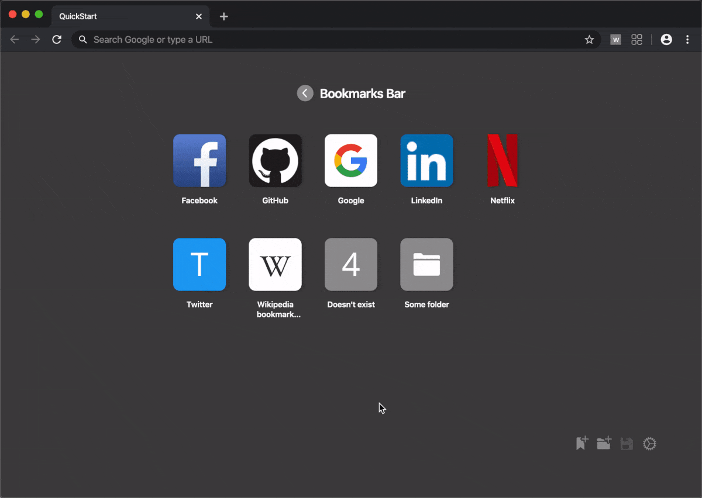

# 

**Bookmark-based browser start page**

QuickStart is a beautiful and clean new tab page for Chrome and Firefox. It is meant to give you quick access to your bookmarks and displays their icons in a grid.

- [**Chrome extension**](https://chrome.google.com/webstore/detail/quickstart/nbiomkiioloimkmidmeahdcjggilcdmp)
- [**Firefox add-on**](https://addons.mozilla.org/en-US/firefox/addon/quickstart)

## Demo

## Development

### Setup

To build the app yourself, you need to have Node.js and Yarn installed. To run the app locally, execute `yarn install` and `yarn start` in the cloned repository.

### Contributing

Suggestions and contributions are always welcome! Please discuss larger changes via issue before submitting a pull request.

## Credits

- UI inspiration: Safari by Apple
- Extension icon: [UI Interface pack](https://www.flaticon.com/packs/ui-interface-24) by Freepik
- In-app icons: [Ionicons v4](https://ionicons.com/v4) by Ionic
- Favicon service: [besticon](https://github.com/mat/besticon)
